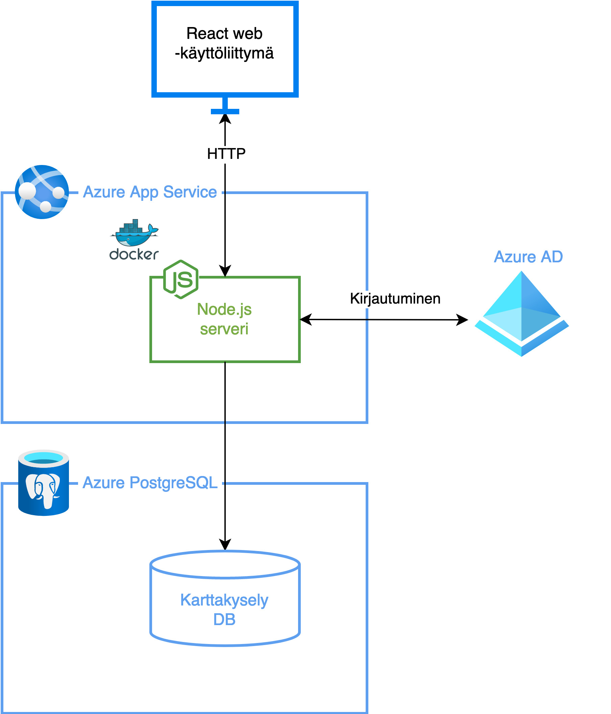

# Vuorovaikutusalusta

## Ohjelmiston taustaa

Kuntien suunnittelussa on keskeistä, että suunnittelua tehdään jatkuvassa vuorovaikutuksessa kuntalaisten kanssa. Vuorovaikutus kuntalaisten kanssa toteutetaan osallistamisella sekä palautteen keräämisellä. Usein kuntalaisten tarpeet ja näkemykset ovat paikkaan sidottuja, jolloin karttakyselypalvelu tulee mukaan kysymykseen. Tarkoituksena on siis toteuttaa vuorovaikutteinen karttakyselypalvelu kuntalaisten osallistamiseksi Tampereen kaupungin kehittämiseen.

## Ohjelmiston komponentit

Ohjelmiston pääkomponentteina toimivat käyttöliittymä, serveri sekä tietokanta. Käyttöliittymässä on käytetty Tampereen Oskari -karttaupotusta. Ohjelmiston ajoympäristönä toimii Microsoft Azure -pilvipalvelu. Pääkomponenttien dokumentaatiot löytyvät kunkin alakansion alta: <code> server, client, db</code>.

Kuva 1: ohjelmiston arkkitehtuuri ajoympäristössään

## Ohjeet sovelluskehitykseen

### Lyhyt ohjeistus:

- Käynnistä Docker -ekosysteemi projektin juuresssa komennoilla `docker-compose build && docker-compose up -d`. Esiehto: lokaalisti tulee olla asennettuna [Docker -konttien hallintajärjestelmä](https://www.docker.com/products/docker-desktop)).
- Luo ympäristömuuttujille tiedosto polkuun `/server/.env` ja täytä se tarvittavilla muuttujilla ohjeen `/server/.template.env` mukaan.
- Toteuta uudet toiminnallisuudet omaan Git -haaraansa, esim. `feature/new-feature-name`. Valmistuessaan yhdistä tämä haara `develop` -haaraan, josta sovellusta ajetaan testiympäristössä. Kun on aika tehdä tuotantopäivitys, vie `develop` -haaran muutokset `master` -haaraan, josta sovellusta ajetaan tuotantoympäristössä.

 

### Pidempi ohjeistus:

Sovelluksen kehitys tapahtuu [Docker](https://docs.docker.com/) -ekosysteemin avulla. Kehitystä varten ohjelmistokehittäjällä on oltava lokaalisti omalla koneellaan asennettuna Docker -kontteja hallinnoiva sovellus, esimerkiksi [Docker Desktop](https://www.docker.com/products/docker-desktop). Docker -kontteja voidaan ohjata komentoriviltä lähdekoodin juuripolusta, jossa Docker -kontteja hallinnoiva konfiguraatiotiedosto _docker-compose.yml_ sijaitsee. Aluksi sovelluksen käyttämät kirjastot ja muut riippuvuudet asennetaan suorittamalla komento `docker-compose build`. Tämän jälkeen Docker -kontit käynnistetään komennolla `docker-compose up -d`. Komento käynnistää kolme eri palvelua: serverin, käyttöliittymän sekä tietokannan. Kullekin näistä luodaan oma docker kontti, joiden nimet ovat vastaavasti `server`, `client` sekä `db`. Serveri käynnistyy lokaalisti osoitteeseen `localhost:3000`, käyttöliittymä osoitteeseen `localhost:8080` sekä tietokanta osoitteeseen `localhost:5432`. Toisinaan konttien käynnistyksessä voi ilmetä virhetilanteita. Yksittäisen kontin lokitietoihin pääsee käsiksi esimerkiksi ajamalla komennon `docker-compose logs -f <kontin-nimi>`, esimerkkinä `docker-compose logs -f server`. Mikäli kontti ei käynnisty tai ilmenee tarve käynnistää kontti uudelleen virhetilanteesta johtuen, voidaan tämä suorittaa komennolla `docker-compose restart <kontin-nimi>`.

Serveri ja tietokanta juttelevat keskenään yhteydellä, joka on määritetty ympäristömuuttujien (environment variables) avulla. Nämä tulee olla määritettyinä serverin juuressa polussa `/server/.env`. Lähdekoodissa on valmiiksi tiedosto, jossa on määritetty kukin tarvittava ympäristömuuttuja: `/server/.template.env`. Kehittäjä voi luoda tästä tiedostosta kopion, nimetä sen `.env`:ksi, ja täyttää tiedostoon tarvittavat ympäristömuuttujat.

Lokaalissa kehityksessä React käyttöliittymä ohjaa rajapintapyynnöt automaattisesti omaan porttiinsa. Toisin sanoen, mikäli käyttöliittymästä (portti 8080) tehdään HTTP pyyntö serverille (portti 3000), tätä ei tarvitse erikseen määrittää, vaan käyttöliittymä osaa ohjata liikenteen suoraan omasta portistaan serverin porttiin (8080 -> 3000).

Sovelluskehitys noudattaa perinteistä [Gitflow](https://www.atlassian.com/git/tutorials/comparing-workflows/gitflow-workflow#:~:text=The%20overall%20flow%20of%20Gitflow,branch%20is%20created%20from%20main&text=When%20a%20feature%20is%20complete%20it%20is%20merged%20into%20the,branch%20is%20created%20from%20main) -mallia, jossa uudet toiminnallisuudet toteutetaan omaan Git -haaraansa, esim. `feature/new-feature-name`. Valmistuessaan tämä haara yhdistetään `develop` -haaraan. Kun `develop` -haaraan kohdistuu muutoksia Githubissa, automaattinen integraatio käynnistyy, joka julkistaa haaraan viedyn uuden lähdekoodin Azureen testiympäristöön. Kun tulee aika tehdä tuotantopäivitys, yhdistetään `develop` -haaran muutokset `master` -haaraan. Githubissa `master` -haaran muutokset käynnistävät automaattisen integraation, joka julkistaa lähdekoodin Azuren DevOps -palveluun. Täältä lähdekoodi taas julkistetaan automaattisesti Azureen tuotantoympäristöön.

## TODO