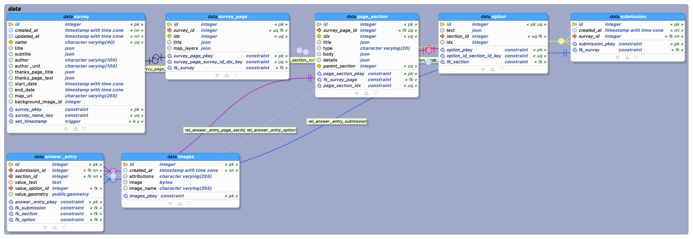
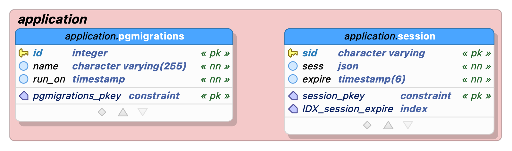

# Tampereen Vuorovaikutusalusta - Tietokanta

Vuorovaikutusalustan tietokannan rakenteen keskiössä ovat Tampereen kaupungin työntekijöiden laatimat kyselyt (_surveys_) sekä kuntalaisten vastaukset (_submissions_) näihin kyselyihin. Kyselyt koostuvat mielivaltaisesta määrästä erityyppisiä kysymyksiä. Kyselyihin voi myös liittyä paikkatiedollinen aspekti, jolloin sekä kysymyksiin että vastauksiin liittyy erilaisia koordinaatteja sekä geometrioita. Tietokantana käytetään _PostgreSQL_ -tietokantaa. [Lisätietoa tietokannasta](https://www.postgresql.org/). Tuki tietokannan geometriatyypeille sekä spatiaalisille funktioille saadaan _PostGIS_ -liitännäisen kautta. [Lisätietoa aiheesta](https://postgis.net/).

Sovelluksen ajoympäristönä toimii Azure -pilvipalvelu. Sovelluksen tietokantapalvelin sijaitsee _tre-kaupunkiymparisto-analytiikka_ -nimisessä resurssiryhmässä, _tre-postgres-analytics_ -nimisellä tietokantapalvelimella. Tietokannan nimi on testiympäristössä _vuorovaikutusalusta_test_db_ ja tuotantoympäristössä _vuorovaikutusalusta_db_. Lokaalissa ohjelmistokehityksessä PostgreSQL tietokanta luodaan Docker -konttina. Tämän konfiguraatio on lähdekoodin juuressa sijaitsevassa _docker-compose.yml_ -tiedostossa.

Sovellus tallentaa tietoja kahteen eri tietokantaskeemaan: _data_ ja _application_. Oheessa kuvaukset kyseisistä skeemoista:

Kuva 1: _data_ skeeman rakenne

Kuva 2: _application_ skeeman rakenne

